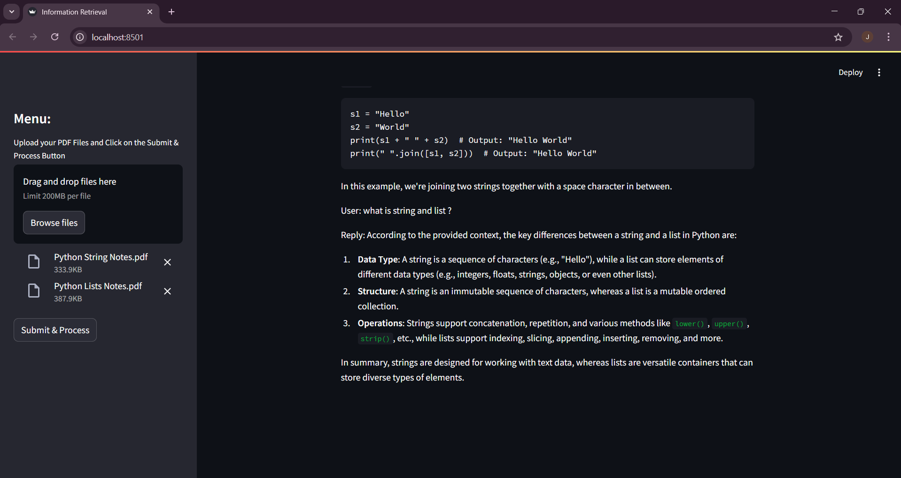

# 📚 AI PDFs Research Assistant using Local LLM (Ollama)

This project is an **offline, fully local document question-answering app** built with:
- 🧠 Open-source LLM (`llama3`) running locally via **Ollama**
- 🔍 Free local embeddings (`sentence-transformers`)
- 🗄️ Vector search with **FAISS**
- 📄 PDF document processing
- 💻 Interactive UI with **Streamlit**

No API keys, no cloud — your data stays **private and local**.

---

## ✅ Features
- Upload PDF files
- Process & chunk text
- Embed with open-source Hugging Face embeddings
- Store in FAISS vector DB
- Ask questions — answers are generated by `llama3` running locally with Ollama

---

## 🛠 Installation

### 1️⃣ Clone the repository
```bash
git clone <https://github.com/JayeshGadhari/Information-Retrieval-System.git>
cd <Information Retrieval System>
```

---

### 2️⃣ Create virtual environment (recommended)
```bash
python -m venv genai
# Windows
genai\Scripts\activate
# macOS/Linux
source genai/bin/activate
```

---

### 3️⃣ Install Python dependencies
```bash
pip install -r requirements.txt
```

**Sample `requirements.txt`:**
```txt
langchain
langchain-community
faiss-cpu
sentence-transformers
PyPDF2
streamlit
python-dotenv
-e .
```

---

### 4️⃣ Install & set up Ollama
- Download from: https://ollama.com/download
- After install, open terminal and run:
```bash
ollama pull llama3
```

To keep the local server running (optional):
```bash
ollama serve
```

---

## 🚀 Run the app
If you built a Streamlit UI:
```bash
streamlit run app.py
```

Or run your Python script directly:
```bash
python your_script.py
```

---

## ⚡ How it works
1. PDF files → extract text
2. Text → split into chunks
3. Chunks → embeddings (using `sentence-transformers/all-MiniLM-L6-v2`)
4. Embeddings stored in FAISS
5. User question → converted to embedding → retrieve similar chunks
6. Local LLM (`llama3`) via Ollama generates answer using context

---

## 🧩 Stack
| Component     | What we use                                   |
|---------------|-----------------------------------------------:|
| LLM           | [llama3](https://ollama.com/library/llama3) via Ollama |
| Embeddings    | `sentence-transformers/all-MiniLM-L6-v2`     |
| Vector DB     | FAISS                                        |
| Backend       | Python + LangChain                            |
| UI            | Streamlit (if you add it)                     |

---

## 📦 Project structure (example)
```
project/
├── app.py
├── main.py
├── requirements.txt
├── README.md
├── genai/                  # (your package if using -e .)
│   ├── __init__.py
│   └── retrieval.py
└── data/                   # PDF files
```

---

## 📸 App Preview  
  

---

---

## 📸 App Preview  
  

---

---

## 🤝 Contributing
PRs and suggestions welcome!

---

## 📄 License
MIT — do what you like!

---

## ✨ Credits
Built with:
- [LangChain](https://github.com/langchain-ai/langchain)
- [Ollama](https://ollama.com)
- [Hugging Face sentence-transformers](https://www.sbert.net/)
- [FAISS](https://github.com/facebookresearch/faiss)
